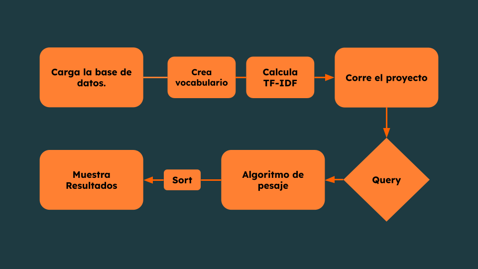
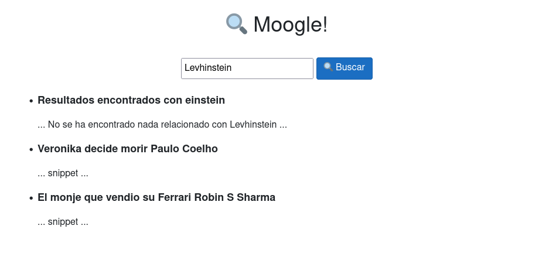

# Moogle


> 1er Proyecto de Programación
> Curso: 2023-2024
> Autor: Diego A. Martínez Jiménez
> Grupo: C121

Simple motor de búsqueda con simple interfaz gráfica.

## Instrucciones para correr el proyecto

* **Abir una terminal en la carpeta del proyecto.**

  **Linux**:

  * ```make dev```

  **Windows**:

  * ```dotnet watch run --project MoogleServer```

## Arquitectura del proyecto

Aceptando la mision que se me fue otorgada, ayude en la implementacion de **Moogle**!. Para ello tuve en cuenta la informacion que me pudieron proporcionar acerca de "**TF-IDF**" y "**Algebra lineal**". Tambien me fue util este link <https://en.wikipedia.org/wiki/Tf%E2%80%93idf>


>Orden de los procesos del proyecto.
>
### **Cargando los documentos**

Lo primero que implemente fue una clase que nombre `Documents` esta contiene varios metodos relacionados con operaciones que se le pueden a hacer a documentos, por ejemplo el metodo `Documents.ReadText()` el cual retorna como string toda el texto de un .txt. Lo mas importante de esta clase es su constructor:

```cs
    public Documents(string path){

            this.path = path;
            int documents = 0;
            
            this.directory = GetDocuments(this.path);
            this.Vocabulary = GetVocabulary();

            foreach( string file in this.directory)documents++;
            this.documents = documents;
            
            this.TF = new Matrix(this.documents,this.words);
            this.IDF = new Vector(new double[words]);
            _IDF = new Vector(new double[words]);

            this.ComputeDocuments();

            _TFIDF = this.TF;
            _Vocabulary = this.Vocabulary;
            Doc = this.directory;
    }
```

Este recibe como parametro `path` que debera ser un string con la direccion de una carpeta donde esten almacenados documentos .txt, _(de no ser asi no garantizo su correcto funcionamiento)_. Al crear una instancia de `Documents` esta asigna un numero a cada termino encontrado en el corpus, (el metodo encargado de este proceso es `Documents.GetVocabulary`) luego el metodo `ComputeDocuments` calcula el TF-IDF de cada documento, creando una matriz donde `TFIDF[i,j]` tiene guardado el TF-IDF de el termino `j` en el documento `i`. Toda la informacion util es almacenada en variables tipo `static` para su uso posterior.

En las clases `Algebra.Vector` y `Algebra.Matrix` estan implementados en metodos las operaciones relacionadas con estos conceptos provenientes del **Algebra Lineal**. Estas son fundamentales para el funcioanmiento de `MoogleEngine.Documents`.

### **Respondiendo la query**

Luego de implementar estas clases, arregle la clase `Moogle` la cual en su momento no era muy util. El objetivo principal de esta clase es responder a la query a traves del metodo `Moogle.Query`. La idea para este metodo es modelar un vector en el que cada componente de este, sea el TF-IDF de cada termino que pertenezca al corpus de documentos. Luego hallar el coseno entre este vector y cada uno de los vectores creados a partir de los documentos.

Primero guardo en variables el TF-IDF, el IDF y el vocabulario previamentes calculados al cargar los documentos.

```cs
    Matrix TFIDF = Documents._TFIDF;
    Vector idf = Documents._IDF;
    Dictionary<string,int> vocabulary = Documents._Vocabulary;
```

Luego calcula el TF-IDF de cada termino en la query, en caso de un termino de la query no encontrarse en `vocabulary` sera ignorado:

```cs

    tfidf = Documents.CalculateTF(query,vocabulary); 

    for(int i = 0; i < idf.Count; i++){
        tfidf[i] *= idf[i];
    }

```

Se almacena luego en `tfidf` que es una variable tipo `Algebra.Vector` para luego calcular el Producto Punto entre `tfidf` y  cada uno de los vectores construidos a partir de la matriz `TFIDF` en esta linea:

```cs
    Vector currentDocTFIDF = new Vector(TFIDF,i);
```

El Producto Punto se calcula con el metodo `Algebra.Vector.DotProduct` que hace pues exactamente lo que su nombre indica. Luego el resultado del calculo sera el `score` de su respectivo documento. Luego los documentos son ordenados con el metodo `Array.Sort` dependiendo de su respectivo `score`. En caso de que el `score` de un documento sea `0` es ignorado pues no tiene relevancia alguna con la query.

Luego se construye un `SearchResult` a partir de esta informacion guardada en `items`.

```cs

    return new SearchResult(items, suggestion);

```

Despues puede ver el resultado en su navegador.

### **Las Sugerencias**

Para las sugerencias use el algoritmo de [Distancia de Levenshtein](https://es.wikipedia.org/wiki/Distancia_de_Levenshtein). Este calcula de forma dinamica el número mínimo de operaciones requeridas para transformar una cadena de caracteres en otra. El metodo para esto es `Documents.EditDistance`.

Al recibir una query la sugerencia se calcula dentro del metodo `Utils.Suggestion` que por cada termino guardado en `vocabulary` calcula su respectiva Distancia de Levenshtein con respecto a la query.

En caso de que no se encuentre ningun termino relacionado con query, `Moogle.Query` retornara los documentos relacionados con la sugerencia.


